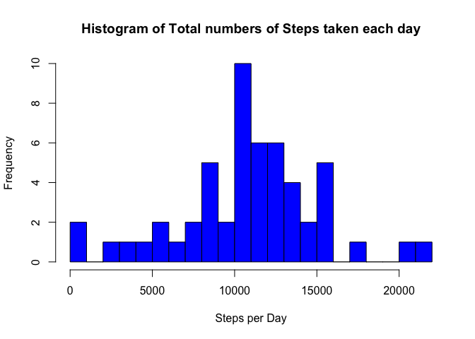
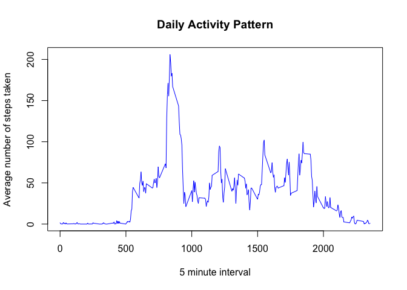
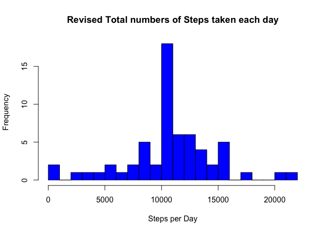
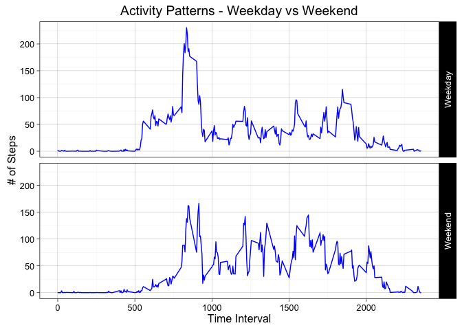

# Reproducible Research: Peer Assessment 1


## 1. Global Settings and libraries

```r
library(knitr)
```

```
## Warning: package 'knitr' was built under R version 3.2.3
```

```r
opts_chunk$set(fig.path='figure/')
library(dplyr)
```

```
## 
## Attaching package: 'dplyr'
```

```
## The following objects are masked from 'package:stats':
## 
##     filter, lag
```

```
## The following objects are masked from 'package:base':
## 
##     intersect, setdiff, setequal, union
```

```r
library(ggplot2)
```

```
## Warning: package 'ggplot2' was built under R version 3.2.4
```

## 2. Loading and preprocessing the data
1. Unzip the data file activity.zip and read the data into a data frame named activity

```r
unzip("activity.zip")
activity <- read.csv("activity.csv")
```

## 3. What is mean total number of steps taken per day?

1. Calculate the total number of steps taken per day ignoring the missing values

```r
numSteps <- activity[complete.cases(activity),] %>%
        group_by(date) %>%
        summarize_each(funs(sum)) %>% 
        select(date, steps)
```

2. Make a histogram of the total number of steps taken each day

```r
hist(numSteps$steps, 
     breaks = floor(nrow(numSteps)/2), 
     main = "Histogram of Total numbers of Steps taken each day", 
     xlab = "Steps per Day", 
     col = "blue")
```

<!-- -->

3. Calculate and report the mean and median of the total number of steps taken per day

```r
meanSteps <- round(mean(numSteps$steps))
medianSteps <- median(numSteps$steps)

cat("Mean Steps per day   : ",meanSteps,"\nMedian Steps per day : ",medianSteps)
```

```
## Mean Steps per day   :  10766 
## Median Steps per day :  10765
```


## 4. What is the average daily activity pattern?

```r
intPatternMean <- activity[complete.cases(activity),] %>% 
        group_by(interval) %>% 
        select(interval, steps) %>% 
        summarize_each(funs(mean))

with(intPatternMean, plot(steps ~ interval, 
                          type = "l", 
                          ylab = "Average number of steps taken",
                          xlab = "5 minute interval",
                          main = "Daily Activity Pattern",
                          col  = "blue")
     )
```

<!-- -->


## 5. Imputing missing values

1. Calculate and report the total number of missing values in the dataset

```r
missValCount <- dim(activity[!complete.cases(activity),])[1]
cat("Total number of missing values in the dataset is : ",missValCount)
```

```
## Total number of missing values in the dataset is :  2304
```

2. Create a new dataset from the original dataset but with the missing values for steps filled in with the mean of the 5-minute interval across all days rounded off

```r
## Duplicate the original data frame
activity1 <- activity

## Fill NA values in activity1 with median of 5 minute intervals
for (i in 1:dim(intPatternMean)[1]) {
        s1 <- c(round(intPatternMean[i, "steps"]))
        int1 <- c(intPatternMean[i, "interval"])
        activity1[activity1$interval == int1 
                  & is.na(activity1$steps),"steps"] <- s1
}
```

3. Make a histogram of the total number of steps taken each day

```r
numSteps1 <- activity1 %>%
        group_by(date) %>%
        summarize_each(funs(sum)) %>% 
        select(date, steps)

hist(numSteps1$steps, 
     breaks = floor(nrow(numSteps)/2), 
     main = "Revised Total numbers of Steps taken each day", 
     xlab = "Steps per Day", 
     col = "blue")
```

<!-- -->

4. Calculate and report the mean and median total number of steps taken per day

```r
meanSteps1 <- round(mean(numSteps1$steps))
medianSteps1 <- median(numSteps1$steps)
cat("Revised Mean and Median Values:","\nMean Steps per day   : ",meanSteps1,
    "\nMedian Steps per day : ",medianSteps1)
```

```
## Revised Mean and Median Values: 
## Mean Steps per day   :  10766 
## Median Steps per day :  10762
```

5. After supplying missing values, the mean of the steps remain unchanged while the median changed from 10765 to 10762. Observed impact of the imputing missing values as per the above methodlogy only resulted in this very minor change in the median. 


## 6. Are there differences in activity patterns between weekdays and weekends?

```r
## Create a day type factor variable from the weekday
daytype <- weekdays(as.Date(activity1$date))
daytype <- gsub("Sunday|Saturday", "Weekend", daytype)
daytype <- gsub("Monday|Tuesday|Wednesday|Thursday|Friday", "Weekday", daytype)
daytype <- as.factor(daytype)

## Bind the new variable to the df - create a new df by summarizing means steps
## over interval and daytype
activity2 <- cbind(activity1,daytype)  %>% 
        group_by(interval,daytype) %>% 
        summarize_each(funs(mean), steps)

## Plot using ggplot system
g1 <- ggplot(activity2, aes(interval, steps))

g1 + geom_line(col="blue") + 
        facet_grid(daytype ~ .) + 
        theme_linedraw(base_size = 12) + 
        labs(list(title = "Activity Patterns - Weekday vs Weekend", 
                  x = "Time Interval", 
                  y = "# of Steps")
             )
```

<!-- -->
